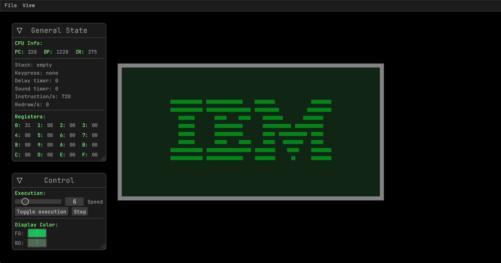
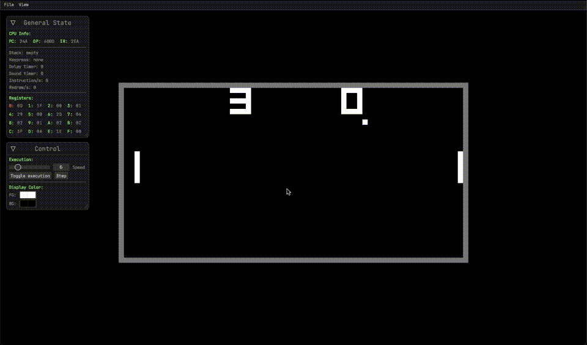

# chip8_rust

This is a CHIP-8 emulator written in Rust as a way of learning Rust & emulation concepts.

<!--  -->


### TODO
* [x] Make a debugger
  * [x] Use a GUI library like egui
  * [x] Use the debugger to fix the Pong issue (paddle position)
* [ ] Make a disassembler
* [ ] Move CHIP-8 unit testing to a separate module (?)
* [ ] Implement all 36 CPU instructions
* [x] Add graphics
* [ ] Add sound
* [ ] Fix the file dialog crashing on macOS (rfd)
* [ ] Fix the non-functional debug information

### Build instructions
```shell
git clone https://github.com/Karta775/chip8_rust
cd chip8_rust
cargo build
```

### Usage
```shell
cargo test # For unit testing
cargo run romfile.ch8 # To run normally
RUST_LOG=debug cargo run romfile.ch8 # To debug
```